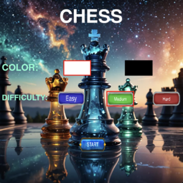

# ♟️ Chess  Game 

A single-player chess game built using “Pygame” for the graphical interface and “Stockfish” for AI decision-making. Battle against one of the strongest chess engines with full support for modern chess rules.

---

## 🚀 Features

- 🎮 Play against AI 
- 📈 AI evaluates and plays optimal moves based on difficulty 
- 🖱️ Click-based controls for intuitive piece movement
- ✅  Legal move validation
- ♟️ Pawn promotion (only to Queen currently)
- 👑 Castling (kingside and queenside)
- ⚔️ En Passant support
- 🧩 Stalemate and draw conditions detection
- 🔊 Sound effects for moves, captures, and game events
- 🧠 Uses the latest Stockfish engine for AI moves

---

## 🧩 Platforms

- ✅ macOS (Release available)
- ✅ Windows (Release available)

Download the latest version:

👉 https://github.com/realms-overflow/Chess/releases/tag/v1.0.0

---

## 🕹️ Gameplay Preview

---

## 📸 Credits 
Piece images and sound effects are sourced from Chess.com. All rights belong to their respective owners.
Used here for educational and non-commercial purposes.

